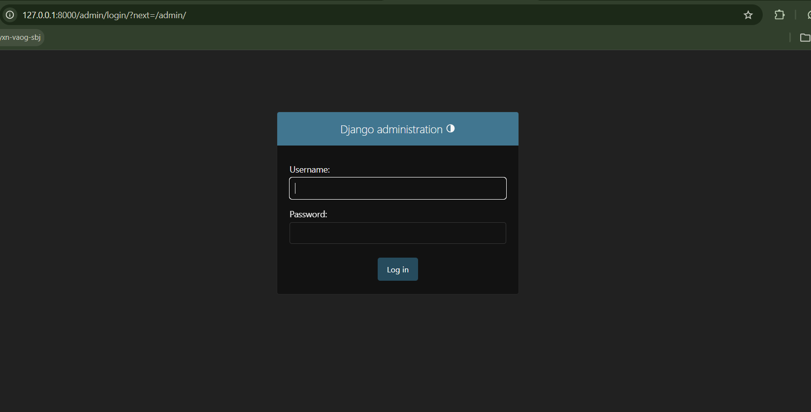

Here's the immediate copy-paste for your README.md file:

```markdown
# MaziwaSync

## Project Overview

MaziwaSync is a Cooperative Management Information System designed to digitize and streamline milk collection, farmer management, communication, and operational analytics within dairy cooperatives.

The system aims to improve transparency, efficiency, accountability, and communication between cooperative administrators, milk porters/collectors, and farmers.

Traditionally, many dairy cooperatives rely on manual records, paper-based tracking, and inefficient communication channels, which often lead to data inconsistencies, delayed payments, poor farmer engagement, and operational inefficiencies. MaziwaSync addresses these challenges through a centralized digital platform built using Django and Django REST Framework.

The platform supports multiple user roles, including administrators, milk porters, and farmers, each with role-specific dashboards and functionalities.

---

# Core Features

* Role-based authentication and authorization
* Milk collection tracking
* Farmer supply monitoring
* Porter activity management
* Cooperative analytics dashboard
* Complaint and feedback management
* Notice board and announcements
* AI-powered sentiment analysis for farmer feedback
* Payment tracking and future Mpesa B2C integration
* Reporting and operational insights

---

# User Roles

## Administrator

Administrators oversee the entire cooperative system. They can:

* Monitor total milk collection
* View porter performance
* Manage farmer complaints
* Publish notices and announcements
* Track analytics and reports
* Monitor payment estimations

---

## Porter / Milk Collector

Porters are responsible for collecting milk from farmers and recording:

* Farmer details
* Amount of milk collected
* Collection session (morning/evening)
* Date and time of collection

---

## Farmer

Farmers can:

* View milk supply history
* Track expected payments
* View notices and announcements
* Submit complaints and comments
* Monitor complaint resolution status
* View supply analytics and trends

---

# Objectives

The main objective of MaziwaSync is to modernize cooperative operations by providing a scalable, secure, and data-driven platform that enhances operational efficiency and farmer welfare.

The system also seeks to improve farmer engagement, operational monitoring, communication, and decision-making through centralized data management and analytics.

---

# Technology Stack

* Backend Framework: Django
* API Framework: Django REST Framework
* Database: MySQL
* Authentication: JWT Authentication
* API Documentation: drf-spectacular (Swagger/OpenAPI)
* Future Integrations:

  * Mpesa Daraja API
  * AI Sentiment Analysis

---

# Software Development Methodology

The project follows an Agile Software Development Lifecycle (SDLC) approach to support iterative development, continuous improvement, modular feature implementation, and continuous testing throughout the course development process.

Development will be carried out in iterative phases (sprints), allowing gradual implementation of features such as authentication, milk collection management, dashboards, analytics, complaints management, and payment integration.

---

# Future Enhancements

* Mpesa B2C automated farmer payments
* AI-based farmer sentiment classification
* SMS notification integration
* Advanced analytics and reporting
* Multi-cooperative support
* Mobile application integration

---

# System Architecture and Application Design

## Architectural Design Decision

MaziwaSync follows a modular application architecture based on the principle of **Separation of Concerns (SoC)**.

Instead of placing all functionalities into a single Django application, the system is divided into specialized modules where each application handles a specific domain responsibility. This improves:

* Maintainability
* Scalability
* Code organization
* Readability
* Team collaboration
* Testing and debugging

The architecture also aligns with professional software engineering practices used in production systems.

---

# Core Design Principles Applied

## 1. Separation of Concerns (SoC)

Each application is responsible for a specific business domain.

Example:

* Authentication logic should not be mixed with milk collection logic.
* Farmer operations should not directly control cooperative administrative operations.

This reduces coupling and improves maintainability.

---

## 2. Modularity

The project is broken into independent modules (apps) that can evolve separately without heavily affecting the entire system.

This supports:

* easier updates
* feature expansion
* isolated testing
* cleaner architecture

---

## 3. Scalability

The architecture is designed to support future enhancements such as:

* Mpesa integration
* AI sentiment analysis
* SMS notifications
* mobile applications
* multi-cooperative support

without requiring major restructuring.

---

## 4. Reusability

Shared functionalities such as authentication, permissions, and notifications can be reused across multiple modules.

---

## 5. Maintainability

A well-structured modular system is easier to debug, document, test, and maintain over time.

---

# System Applications

The project uses five main Django applications.

---

# 1. Core Application

## Responsibilities

The core application handles:

* Custom user model
* Base model abstractions
* System-wide shared models
* Common utilities and mixins

## Engineering Reasoning

A dedicated core app provides:
- Cleaner separation of authentication logic from user management
- Better reusability across the entire system
- Prevention of circular import issues
- A single source of truth for the base user model

---

# 2. Accounts Application

## Responsibilities

The accounts application handles:

* User authentication
* JWT authentication
* User registration
* Role management
* User profiles
* Authorization and permissions

## Supported Roles

* Administrator
* Farmer
* Porter / Milk Collector

## Engineering Reasoning

Authentication is isolated because it is a shared system-wide responsibility used across all modules.

---

# 3. Cooperative Application

## Responsibilities

The cooperative application handles:

* Cooperative dashboard
* Notices and announcements
* Complaints management
* Analytics and reports
* Payment calculations
* Farmer welfare tracking
* Administrative operations

## Engineering Reasoning

Administrative and management operations are grouped together because they belong to the cooperative business domain.

---

# 4. Collector Application

## Responsibilities

The collector application handles:

* Milk collection records
* Collection sessions
* Farmer milk entries
* Daily collection tracking
* Collection history

## Engineering Reasoning

Milk collection is the system's operational core process and deserves isolation from administrative logic.

---

# 5. Farmer Application

## Responsibilities

The farmer application handles:

* Farmer dashboard
* Supply history
* Farmer analytics
* Complaints submission
* Viewing notices
* Payment estimations

## Engineering Reasoning

Farmer-facing functionality is isolated to improve user-specific logic management and support future mobile or farmer portal integrations.

---

# Initial Project Setup

## Step 1: Create the Django Project

```bash
django-admin startproject maziwasyncapi
```

Move into the project directory:

```bash
cd maziwasyncapi
```

---

## Step 2: Create Virtual Environment

```bash
python -m venv venv
```

Activate the environment.

### Windows

```bash
venv\Scripts\activate
```

### Linux/macOS

```bash
source venv/bin/activate
```

---

## Step 3: Install Dependencies

```bash
pip install django djangorestframework mysqlclient drf-spectacular djangorestframework-simplejwt django-cors-headers python-decouple
```

---

## Step 4: Save Dependencies

```bash
pip freeze > requirements.txt
```

---

## Step 5: Create the Applications

```bash
python manage.py startapp core
python manage.py startapp accounts
python manage.py startapp cooperative
python manage.py startapp collector
python manage.py startapp farmer
```

---

## Step 6: Configure Settings

### AUTH_USER_MODEL Declaration

In `maziwasyncapi/settings.py`:

```python
AUTH_USER_MODEL = 'core.User'
```

### INSTALLED_APPS Configuration

```python
INSTALLED_APPS = [
    # Default Django Apps
    'django.contrib.admin',
    'django.contrib.auth',
    'django.contrib.contenttypes',
    'django.contrib.sessions',
    'django.contrib.messages',
    'django.contrib.staticfiles',

    # Third-Party Apps
    'rest_framework',
    'drf_spectacular',

    # Local Apps
    'core',
    'accounts',
    'cooperative',
    'collector',
    'farmer',
]
```

### REST Framework Configuration

```python
REST_FRAMEWORK = {
    'DEFAULT_AUTHENTICATION_CLASSES': (
        'rest_framework_simplejwt.authentication.JWTAuthentication',
    ),
    'DEFAULT_PERMISSION_CLASSES': (
        'rest_framework.permissions.IsAuthenticated',
    ),
    'DEFAULT_SCHEMA_CLASS': 'drf_spectacular.openapi.AutoSchema',
    'DEFAULT_PAGINATION_CLASS': 'rest_framework.pagination.PageNumberPagination',
    'PAGE_SIZE': 20,
}
```

### JWT Settings

```python
from datetime import timedelta

SIMPLE_JWT = {
    'ACCESS_TOKEN_LIFETIME': timedelta(days=1),
    'REFRESH_TOKEN_LIFETIME': timedelta(days=7),
}
```

### Database Configuration

```python
from decouple import config

DATABASES = {
    'default': {
        'ENGINE': 'django.db.backends.mysql',
        'NAME': config('DB_NAME', default='maziwasyncdb'),
        'USER': config('DB_USER', default='root'),
        'PASSWORD': config('DB_PASSWORD', default=''),
        'HOST': config('DB_HOST', default='localhost'),
        'PORT': config('DB_PORT', default='3306'),
    }
}
```

### CORS Configuration

```python
CORS_ALLOW_ALL_ORIGINS = True  # Development only
```

### Static & Media Files

```python
STATIC_URL = 'static/'
STATIC_ROOT = os.path.join(BASE_DIR, 'staticfiles')

MEDIA_URL = 'media/'
MEDIA_ROOT = os.path.join(BASE_DIR, 'media')
```

### Environment Variables (.env file)

```env
SECRET_KEY=your-super-secret-key-change-this
DEBUG=True
ALLOWED_HOSTS=localhost,127.0.0.1

DB_NAME=maziwasyncdb
DB_USER=root
DB_PASSWORD=
DB_HOST=localhost
DB_PORT=3306
```

---
You're absolutely right! Here's the corrected `core/models.py` section for your README.md that matches YOUR actual implementation:

```markdown
## Step 7: Create Models in Core Application

In `core/models.py`:

```python
from django.db import models
from django.contrib.auth.models import AbstractUser

# ============================================================
# CUSTOM USER MODEL (First - before any profile uses it)
# ============================================================

class User(AbstractUser):
    """Custom User model with role-based access"""
    ROLE_CHOICES = (
        ('farmer', 'Farmer'),
        ('porter', 'Porter'),
        ('admin', 'Admin'),
    )
    role = models.CharField(max_length=10, choices=ROLE_CHOICES, default='farmer')
    phone_number = models.CharField(max_length=15, unique=True)
    
    def __str__(self):
        return f"{self.username} ({self.role})"

# ============================================================
# BASE ABSTRACT MODEL
# ============================================================

class BaseModel(models.Model):
    """Abstract base model with common timestamp fields"""
    created_at = models.DateTimeField(auto_now_add=True)
    updated_at = models.DateTimeField(auto_now=True)
    
    class Meta:
        abstract = True


# ============================================================
# FARMER PROFILE
# ============================================================

class FarmerProfile(BaseModel):
    """Complete farmer profile - all information a cooperative needs"""
    
    user = models.OneToOneField(
        User, 
        on_delete=models.CASCADE, 
        related_name='farmer_profile'
    )
    
    # Personal Information
    profile_image = models.ImageField(
        upload_to='farmers/profiles/', 
        null=True, 
        blank=True
    )
    national_id = models.CharField(max_length=20, unique=True)
    first_name = models.CharField(max_length=100)
    last_name = models.CharField(max_length=100)
    date_of_birth = models.DateField(null=True, blank=True)
    gender = models.CharField(
        max_length=10, 
        choices=[('MALE', 'Male'), ('FEMALE', 'Female')], 
        null=True, 
        blank=True
    )
    
    # Contact Information
    phone_number = models.CharField(max_length=15, unique=True)
    alternate_phone = models.CharField(max_length=15, blank=True, null=True)
    email_address = models.EmailField(blank=True, null=True)
    
    # Farm Information
    farm_name = models.CharField(max_length=200, blank=True, null=True)
    farm_size_acres = models.DecimalField(max_digits=6, decimal_places=2, null=True, blank=True)
    number_of_cows = models.IntegerField(default=0)
    membership_number = models.CharField(max_length=50, unique=True, blank=True, null=True)
    join_date = models.DateField(auto_now_add=True)
    
    # Banking Information
    bank_name = models.CharField(max_length=100, blank=True, null=True)
    bank_branch = models.CharField(max_length=100, blank=True, null=True)
    account_number = models.CharField(max_length=50, blank=True, null=True)
    mpesa_number = models.CharField(max_length=15, blank=True, null=True)
    
    # Statistics (auto-updated by system)
    total_milk_delivered = models.DecimalField(max_digits=12, decimal_places=2, default=0)
    total_earnings = models.DecimalField(max_digits=15, decimal_places=2, default=0)
    
    def __str__(self):
        return f"{self.first_name} {self.last_name}"


# ============================================================
# PORTER PROFILE
# ============================================================

class PorterProfile(BaseModel):
    """Porter/Collector profile"""
    
    user = models.OneToOneField(
        User, 
        on_delete=models.CASCADE, 
        related_name='porter_profile'
    )
    profile_image = models.ImageField(
        upload_to='porters/profiles/', 
        null=True, 
        blank=True
    )
    employee_id = models.CharField(max_length=20, unique=True)
    first_name = models.CharField(max_length=100)
    last_name = models.CharField(max_length=100)
    phone_number = models.CharField(max_length=15, unique=True)
    national_id = models.CharField(max_length=20, unique=True)
    route_name = models.CharField(max_length=200)
    assigned_farmers = models.ManyToManyField(
        FarmerProfile, 
        related_name='assigned_porters', 
        blank=True
    )
    hire_date = models.DateField(auto_now_add=True)
    is_active = models.BooleanField(default=True)
    total_collections = models.IntegerField(default=0)
    total_liters_collected = models.DecimalField(max_digits=12, decimal_places=2, default=0)
    
    def __str__(self):
        return f"{self.first_name} {self.last_name} - {self.employee_id}"


# ============================================================
# MILK COLLECTION
# ============================================================

class MilkCollection(BaseModel):
    """Daily milk collection record"""
    
    SESSION_CHOICES = [
        ('MORNING', 'Morning'),
        ('EVENING', 'Evening'),
    ]
    
    farmer = models.ForeignKey(
        FarmerProfile, 
        on_delete=models.CASCADE, 
        related_name='collections'
    )
    porter = models.ForeignKey(
        PorterProfile, 
        on_delete=models.CASCADE, 
        related_name='collections'
    )
    liters = models.DecimalField(max_digits=10, decimal_places=2)
    session = models.CharField(max_length=10, choices=SESSION_CHOICES)
    collection_date = models.DateField(auto_now_add=True)
    price_per_liter = models.DecimalField(max_digits=8, decimal_places=2, default=50.00)
    total_amount = models.DecimalField(max_digits=12, decimal_places=2, blank=True, null=True)
    
    def __str__(self):
        return f"{self.collection_date}: {self.farmer.first_name} - {self.liters}L"
    
    def save(self, *args, **kwargs):
        self.total_amount = self.liters * self.price_per_liter
        super().save(*args, **kwargs)


# ============================================================
# COMPLAINT
# ============================================================

class Complaint(BaseModel):
    """Farmer complaints tracking"""
    
    STATUS_CHOICES = [
        ('PENDING', 'Pending'),
        ('RESOLVED', 'Resolved'),
        ('REJECTED', 'Rejected'),
    ]
    
    farmer = models.ForeignKey(
        FarmerProfile, 
        on_delete=models.CASCADE, 
        related_name='complaints'
    )
    title = models.CharField(max_length=200)
    description = models.TextField()
    status = models.CharField(max_length=10, choices=STATUS_CHOICES, default='PENDING')
    resolved_by = models.ForeignKey(
        User, 
        on_delete=models.SET_NULL, 
        null=True, 
        blank=True
    )
    
    def __str__(self):
        return self.title


# ============================================================
# NOTICE / ANNOUNCEMENT
# ============================================================

class Notice(BaseModel):
    """System announcements for different user groups"""
    
    TARGET_CHOICES = [
        ('ALL', 'All Users'),
        ('FARMERS', 'Farmers Only'),
        ('PORTERS', 'Porters Only'),
    ]
    
    title = models.CharField(max_length=200)
    message = models.TextField()
    target = models.CharField(max_length=10, choices=TARGET_CHOICES, default='ALL')
    created_by = models.ForeignKey(User, on_delete=models.CASCADE)
    is_important = models.BooleanField(default=False)
    
    def __str__(self):
        return self.title


# ============================================================
# PAYMENT
# ============================================================

class Payment(BaseModel):
    """Payment records for milk deliveries"""
    
    STATUS_CHOICES = [
        ('PENDING', 'Pending'),
        ('COMPLETED', 'Completed'),
        ('FAILED', 'Failed'),
    ]
    
    METHOD_CHOICES = [
        ('MPESA', 'M-Pesa'),
        ('CASH', 'Cash'),
    ]
    
    farmer = models.ForeignKey(
        FarmerProfile, 
        on_delete=models.CASCADE, 
        related_name='payments'
    )
    amount = models.DecimalField(max_digits=12, decimal_places=2)
    payment_method = models.CharField(max_length=10, choices=METHOD_CHOICES)
    status = models.CharField(max_length=10, choices=STATUS_CHOICES, default='PENDING')
    transaction_ref = models.CharField(max_length=100, unique=True)
    payment_date = models.DateTimeField()
    
    def __str__(self):
        return f"{self.transaction_ref} - KES {self.amount}"
```

---

## Step 8: Create and Apply Migrations

```bash
python manage.py makemigrations
python manage.py migrate
```

---

## Database Schema Overview

The core app contains the following models:

| Model | Purpose |
|-------|---------|
| `User` | Custom user with role-based authentication |
| `BaseModel` | Abstract base with timestamps (inherited by all models) |
| `FarmerProfile` | Complete farmer information and statistics |
| `PorterProfile` | Milk collector/porter information |
| `MilkCollection` | Daily milk collection records |
| `Complaint` | Farmer complaint tracking |
| `Notice` | System announcements |
| `Payment` | Payment records for milk deliveries |

## Model Relationships

```
User (auth)
  ├── FarmerProfile (OneToOne)
  │     ├── MilkCollection (ForeignKey)
  │     ├── Complaint (ForeignKey)
  │     └── Payment (ForeignKey)
  │
  └── PorterProfile (OneToOne)
        ├── MilkCollection (ForeignKey)
        └── assigned_farmers (ManyToMany with FarmerProfile)
```


---

## Step 8: Create and Apply Migrations

```bash
python manage.py makemigrations
python manage.py migrate
```

---

# Expected Project Structure

```
maziwasyncapi/
│
├── core/
│   ├── models.py
│   ├── admin.py
│   └── ...
│
├── accounts/
├── cooperative/
├── collector/
├── farmer/
│
├── maziwasyncapi/
│   ├── settings.py
│   └── ...
│
├── manage.py
└── requirements.txt
```

---

# Important Engineering Decisions

## Why Core App Instead of Accounts App for User Model?

| Consideration | Benefit |
|--------------|---------|
| Circular Imports | Clean dependency tree |
| Reusability | System-wide accessibility |
| Separation of Concerns | Pure base model isolation |
| Future Extensibility | Easy to add shared models |

## Migration Strategy (Critical Order)

1. Create `core` app and define `User` model
2. Set `AUTH_USER_MODEL = 'core.User'` in settings
3. Register all apps in INSTALLED_APPS
4. Create migrations for all apps simultaneously
5. Apply migrations in one operation

---

# ⚠️ Critical Reminders

1. **Never change AUTH_USER_MODEL after migrations** - It's set for the project lifetime
2. **Core app must be in INSTALLED_APPS** - Other apps depend on it
3. **Always reference User as `settings.AUTH_USER_MODEL`** - Never import directly
4. **Document architectural decisions** - Future developers need to understand design choices

---

# Engineering Questions Considered During Design

## System Architecture Questions

* Should the system use monolithic or modular architecture?
* How can the project remain scalable as features grow?
* Which responsibilities belong to which modules?

## Authentication Questions

* Should user roles be separated or centralized?
* Should the system extend Django's default user model?
* How can permissions be managed securely?

## Database Design Questions

* How should relationships between farmers, collectors, and collections be structured?
* How can data consistency be maintained during transactions?
* Should transactional operations support rollback mechanisms?

## Scalability Questions

* Can the architecture support future Mpesa integration?
* Can AI features be added without restructuring the system?
* Can mobile applications consume the same APIs later?

## Maintainability Questions

* How can code duplication be minimized?
* How can future developers easily understand the system?
* How can debugging and testing be simplified?

---

# Software Engineering Principles Applied

1. **Single Responsibility Principle** - Each app handles one domain
2. **Separation of Concerns** - Clear boundaries between modules
3. **Don't Repeat Yourself (DRY)** - Shared logic in core app
4. **API-First Design** - All features exposed via REST endpoints
5. **Security by Design** - JWT authentication, environment variables
```


Here's the formatted section for your README.md:

```markdown
## Step 9: Register Models in Django Admin

Create `core/admin.py`:

```python
from django.contrib import admin
from .models import User, FarmerProfile, PorterProfile, MilkCollection, Complaint, Notice, Payment

# Register Custom User
@admin.register(User)
class UserAdmin(admin.ModelAdmin):
    list_display = ('username', 'email', 'role', 'phone_number', 'is_staff')
    list_filter = ('role', 'is_staff')
    search_fields = ('username', 'email', 'phone_number')

# Register FarmerProfile
@admin.register(FarmerProfile)
class FarmerProfileAdmin(admin.ModelAdmin):
    list_display = ('first_name', 'last_name', 'phone_number', 'farm_name', 'total_milk_delivered')
    search_fields = ('first_name', 'last_name', 'phone_number', 'national_id')
    list_filter = ('gender', 'join_date')

# Register PorterProfile
@admin.register(PorterProfile)
class PorterProfileAdmin(admin.ModelAdmin):
    list_display = ('first_name', 'last_name', 'employee_id', 'route_name', 'total_collections')
    search_fields = ('first_name', 'last_name', 'employee_id')
    list_filter = ('is_active', 'hire_date')

# Register MilkCollection
@admin.register(MilkCollection)
class MilkCollectionAdmin(admin.ModelAdmin):
    list_display = ('farmer', 'liters', 'session', 'collection_date', 'total_amount')
    list_filter = ('session', 'collection_date')
    search_fields = ('farmer__first_name', 'farmer__last_name', 'porter__first_name', 'porter__last_name')
    readonly_fields = ('total_amount',)

# Register Complaint
@admin.register(Complaint)
class ComplaintAdmin(admin.ModelAdmin):
    list_display = ('title', 'farmer', 'status', 'created_at')
    list_filter = ('status',)
    search_fields = ('title', 'farmer__first_name', 'farmer__last_name')

# Register Notice
@admin.register(Notice)
class NoticeAdmin(admin.ModelAdmin):
    list_display = ('title', 'target', 'is_important', 'created_at')
    list_filter = ('target', 'is_important')
    search_fields = ('title', 'message')

# Register Payment
@admin.register(Payment)
class PaymentAdmin(admin.ModelAdmin):
    list_display = ('farmer', 'amount', 'payment_method', 'status', 'payment_date')
    list_filter = ('status', 'payment_method')
    search_fields = ('farmer__first_name', 'farmer__last_name', 'transaction_ref')
```

---

## Step 10: Create Admin Superuser

```bash
python manage.py createsuperuser
```

Follow the prompts to create an admin account:

```
Username: admin
Email: admin@example.com
Password: yourpassword
```

---

## Step 11: Run Development Server

```bash
python manage.py runserver
```

Access the applications:

- Admin Panel: http://127.0.0.1:8000/admin/
- API Endpoints: http://127.0.0.1:8000/api/

---

## Admin Panel Features

After registering all models, the Django admin panel provides:

| Model | Admin Capabilities |
|-------|-------------------|
| **User** | View, filter by role, search users |
| **FarmerProfile** | Manage farmer data, search by name/ID/national ID |
| **PorterProfile** | Manage porters, filter by active status |
| **MilkCollection** | View collections, filter by session/date, auto-calculated amounts |
| **Complaint** | Track and resolve farmer complaints |
| **Notice** | Create and manage announcements for different user groups |
| **Payment** | Track payment status and methods |

---

## Admin Screenshot




# Step 12: Implement Core Authentication

MaziwaSync uses JWT (JSON Web Token) Authentication through Django REST Framework SimpleJWT.

The authentication module is responsible for:

* Registering Farmers
* Registering Porters
* User Login
* User Logout
* Token Refresh
* Retrieving Current Logged-in User Information

---

# Authentication URLs

Create `accounts/urls.py`

```python
from django.urls import path
from .views import LogoutView, RegisterView, LoginView, MeView
from rest_framework_simplejwt.views import TokenRefreshView

urlpatterns = [
    path('auth/register/', RegisterView, name='register'),
    path('auth/login/', LoginView, name='login'),
    path('auth/logout/', LogoutView, name='logout'),
    path('auth/me/', MeView, name='me'),

    # Refresh Access Token
    path('token/refresh/', TokenRefreshView.as_view(), name='token_refresh'),
]
```

---

# JWT Configuration

Inside `settings.py`

```python
from datetime import timedelta

SIMPLE_JWT = {
    'ACCESS_TOKEN_LIFETIME': timedelta(minutes=1),
    'REFRESH_TOKEN_LIFETIME': timedelta(days=7),

    'ROTATE_REFRESH_TOKENS': True,
    'BLACKLIST_AFTER_ROTATION': True,
}
```

### Explanation

| Setting                  | Purpose                                    |
| ------------------------ | ------------------------------------------ |
| ACCESS_TOKEN_LIFETIME    | Access token expires after 1 minute        |
| REFRESH_TOKEN_LIFETIME   | Refresh token valid for 7 days             |
| ROTATE_REFRESH_TOKENS    | Generates a new refresh token each refresh |
| BLACKLIST_AFTER_ROTATION | Invalidates old refresh tokens             |

---

# Enable Token Blacklisting

Add the blacklist app inside `INSTALLED_APPS`

```python
INSTALLED_APPS = [
    ...

    'rest_framework',
    'rest_framework_simplejwt',
    'rest_framework_simplejwt.token_blacklist',

    ...
]
```

---

# IMPORTANT: Run Migrations

After adding token blacklisting, migrations MUST be executed.

```bash
python manage.py makemigrations
python manage.py migrate
```

This creates the blacklist tables required for logout and token invalidation.

Failure to run migrations will cause logout functionality to fail.

---

# Registration Endpoint

URL

```http
POST /api/auth/register/
```

Permission

```text
Admin Only
```

The administrator creates farmer and porter accounts.

---

## Register Farmer Example

```json
{
    "username": "farmer001",
    "email": "farmer001@gmail.com",
    "password": "password123",
    "role": "farmer",
    "phone_number": "0712345678",

    "first_name": "John",
    "last_name": "Kamau",
    "national_id": "12345678",
    "farm_name": "Green Farm"
}
```

Response

```json
{
    "user_id": 2,
    "username": "farmer001",
    "role": "farmer",
    "message": "Farmer registered successfully."
}
```

---

## Register Porter Example

```json
{
    "username": "porter001",
    "email": "porter001@gmail.com",
    "password": "password123",
    "role": "porter",
    "phone_number": "0798765432",

    "first_name": "Peter",
    "last_name": "Mwangi",
    "employee_id": "EMP001",
    "national_id": "98765432",
    "route_name": "Route A"
}
```

Response

```json
{
    "user_id": 3,
    "username": "porter001",
    "role": "porter",
    "message": "Porter registered successfully."
}
```

---

# Login Endpoint

URL

```http
POST /api/auth/login/
```

Permission

```text
Public
```

Request

```json
{
    "username": "farmer001",
    "password": "password123"
}
```

Response

```json
{
    "access": "jwt_access_token",
    "refresh": "jwt_refresh_token",
    "user_id": 2,
    "username": "farmer001",
    "role": "farmer"
}
```

Store both tokens because they will be needed later.

---

# Current Logged User Endpoint

URL

```http
GET /api/auth/me/
```

Header

```http
Authorization: Bearer access_token
```

---

## Farmer Response

```json
{
    "id": 2,
    "username": "farmer001",
    "role": "farmer",
    "profile": {
        "first_name": "John",
        "last_name": "Kamau",
        "phone_number": "0712345678",
        "farm_name": "Green Farm"
    }
}
```

---

## Porter Response

```json
{
    "id": 3,
    "username": "porter001",
    "role": "porter",
    "profile": {
        "first_name": "Peter",
        "last_name": "Mwangi",
        "employee_id": "EMP001",
        "route_name": "Route A"
    }
}
```

---

# Refresh Token Endpoint

Since access tokens expire after one minute, the frontend should request a new access token using the refresh token.

URL

```http
POST /api/token/refresh/
```

Request

```json
{
    "refresh": "your_refresh_token"
}
```

Response

```json
{
    "access": "new_access_token",
    "refresh": "new_refresh_token"
}
```

---

# Logout Endpoint

URL

```http
POST /api/auth/logout/
```

Header

```http
Authorization: Bearer access_token
```

Body

```json
{
    "refresh": "your_refresh_token"
}
```

Response

```json
{
    "message": "Logout successful."
}
```

The refresh token is added to the blacklist and can no longer be used.

---

# Authentication Flow

```text
Admin Login
      │
      ▼
Create Farmer/Porter Account
      │
      ▼
User Login
      │
      ▼
Receive Access Token
Receive Refresh Token
      │
      ▼
Access Protected Endpoints
      │
      ▼
Access Token Expires
      │
      ▼
Call /token/refresh/
      │
      ▼
Receive New Access Token
      │
      ▼
Continue Using System
      │
      ▼
Logout
      │
      ▼
Refresh Token Blacklisted
```

---

# Testing Authentication Using Insomnia

## 1. Login

Create a POST request

```http
POST http://127.0.0.1:8000/api/auth/login/
```

Body → JSON

```json
{
    "username": "admin",
    "password": "adminpassword"
}
```

Copy:

* access token
* refresh token

---

## 2. Register Farmer

Create POST request

```http
POST http://127.0.0.1:8000/api/auth/register/
```

Header

```http
Authorization: Bearer ACCESS_TOKEN
```

Body

```json
{
    "username": "farmer001",
    "email": "farmer001@gmail.com",
    "password": "password123",
    "role": "farmer",
    "phone_number": "0712345678",
    "first_name": "John",
    "last_name": "Kamau",
    "national_id": "12345678",
    "farm_name": "Green Farm"
}
```

Expected Response

```json
{
    "message": "Farmer registered successfully."
}
```

---

## 3. Test Me Endpoint

Create GET request

```http
GET http://127.0.0.1:8000/api/auth/me/
```

Header

```http
Authorization: Bearer ACCESS_TOKEN
```

Expected Result

Current user information should be returned.

---

## 4. Test Expired Token

Wait one minute.

Call:

```http
GET /api/auth/me/
```

Expected Response

```json
{
    "detail": "Given token not valid for any token type"
}
```

---

## 5. Refresh Token

Create POST request

```http
POST http://127.0.0.1:8000/api/token/refresh/
```

Body

```json
{
    "refresh": "YOUR_REFRESH_TOKEN"
}
```

Expected Result

New access token returned.

---

## 6. Logout

Create POST request

```http
POST http://127.0.0.1:8000/api/auth/logout/
```

Header

```http
Authorization: Bearer ACCESS_TOKEN
```

Body

```json
{
    "refresh": "YOUR_REFRESH_TOKEN"
}
```

Expected Result

```json
{
    "message": "Logout successful."
}
```

The refresh token becomes invalid and cannot be reused.
